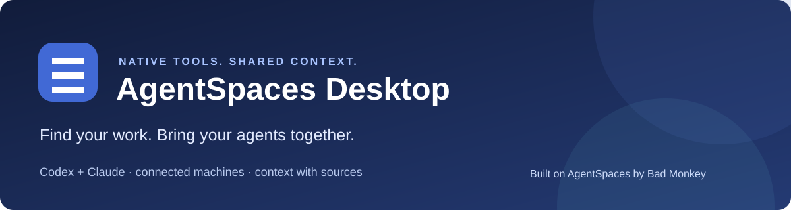
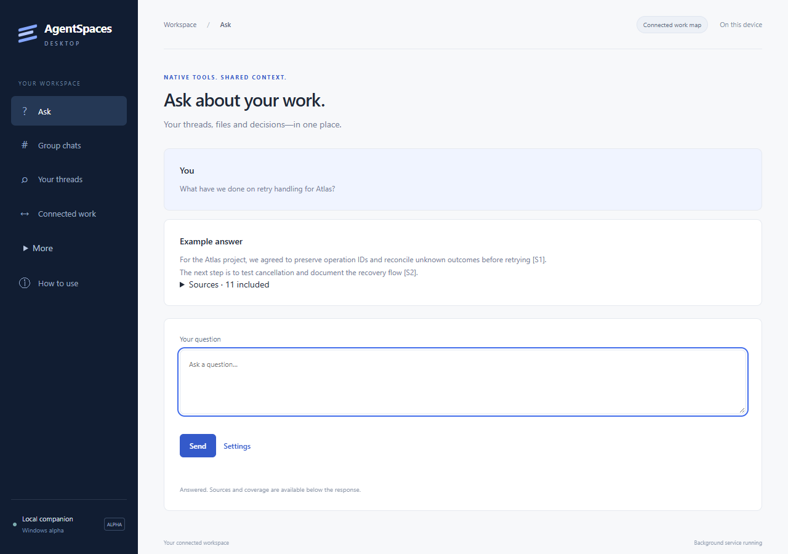
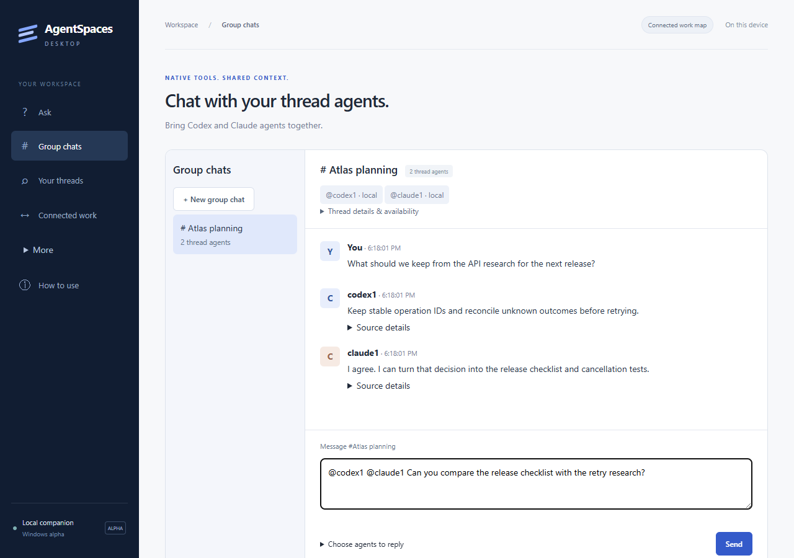
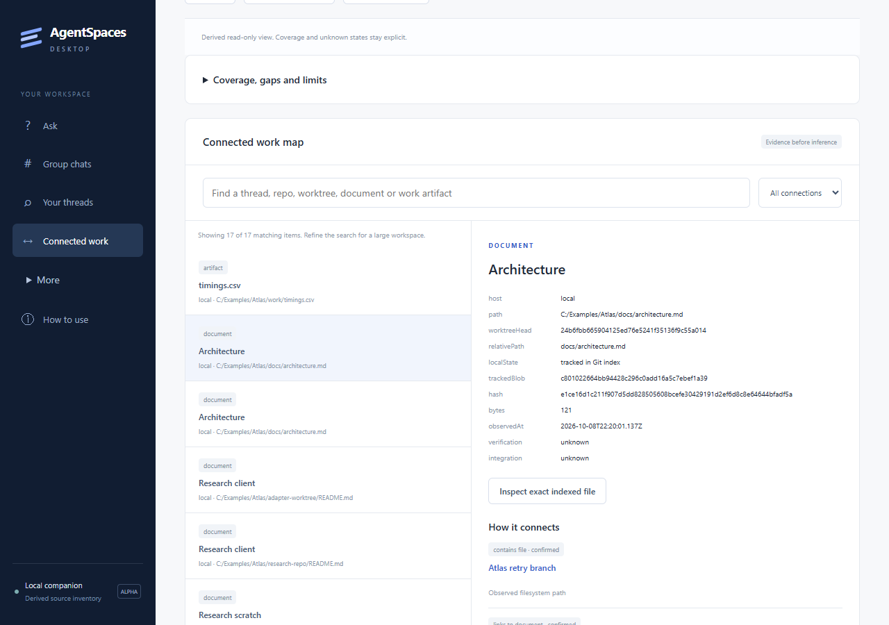
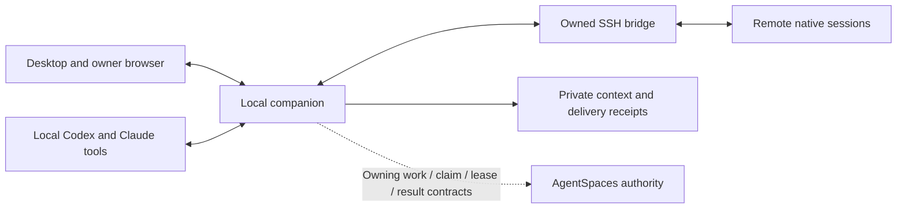

# AgentSpaces Desktop

**Built on [AgentSpaces](https://www.badmonkey.ai/agentspaces/) by [BadMonkey](https://www.badmonkey.ai/).**

[Star the original AgentSpaces project](https://github.com/badmonkeyai/AgentSpaces) · [Explore AgentSpaces](https://www.badmonkey.ai/agentspaces/) · [BadMonkey on GitHub](https://github.com/badmonkeyai) · [AgentSpaces framework](https://github.com/badmonkeyai/AgentSpaces)

**Find your work. Bring your agents together. Keep the context.**

Working across Codex, Claude and an SSH machine should not require carrying messages between chats. AgentSpaces Desktop connects your permitted native threads, repositories, worktrees and documents in one workspace. Ask “What have we done on retry handling?” and get an answer with sources. Ask relevant thread agents to compare their findings, update a table or join a discussion, then see their attributed replies together.

**Runs headlessly—no desktop window required.** The companion service and agent interfaces work without launching the Electron desktop app. The desktop is an optional interface. The local companion keeps running while the window is closed. The current topology supports this device and one configured SSH host; additional-host onboarding is still outstanding. Your native tools keep their own login, permissions and conversations.

Use your existing native tool logins. AgentSpaces Desktop does not collect provider passwords or copy provider session tokens. Optional API answering is a separate advanced connection.

**Open-source alpha, Apache 2.0.** Windows installer and Linux archive packaging are implemented. Builds are unsigned; native and platform qualification remain explicit. See [release readiness](docs/open-source-readiness.md).

The first-run improvements described below are source changes awaiting a new installer release; v0.1.0-alpha.3 still uses the earlier setup flow.

## Coordination tools in source

The shared work board now has a **decision inbox** and **fair machine queue**.
Agents submit questions with options and recommendations; the owner records an
answer. Scoped approval requests additionally require a separate owner password,
retain expiry/revocation receipts, and notify only the requesting thread. Native
threads must explicitly trust these receipts; native tool permissions remain
separate. Machine requests share a visible queue with release priority, aging,
whole-machine reservations and bounded runtimes. A Linux runner acquires the
existing host locks before executing an explicitly supplied command. All three
surfaces have scoped agent APIs and headless access. These additions are source
features, not part of the alpha.3 download. See [coordination](docs/coordination.md)
and [work board](docs/work-board.md) for setup and qualification limits.

## Get started

Download the [v0.1.0-alpha.3 builds](https://github.com/Weston-Tyler/agentspaces-desktop/releases/tag/v0.1.0-alpha.3), then follow the [installation guide](docs/installer.md). Windows setup adds AgentSpaces Desktop to Start/search and Installed apps. The Linux archive includes a per-user applications-menu installer. Existing Codex/Claude tools and sign-in remain prerequisites; packaged builds include their own application Node runtime. [All releases](https://github.com/Weston-Tyler/agentspaces-desktop/releases) retain their version-specific artifacts and checksums.

1. Open AgentSpaces Desktop through its installed launcher.
2. Use the first-run links to install a supported native tool if needed, then sign in through Native chat. Ask currently uses Codex; Claude Code can participate in group chats.
3. Choose **Connect work on this device**. SSH is optional; select another computer only after configuring its connection.
4. Ask about existing work, or open a group and address the relevant threads.

For example, ask an agent: “Find the Codex thread about retry handling and ask it for its results.” In a group, send `@all Please report your branch, tests and blockers.` To reach topical peers, use `@recent(30d) @topic("chillit recipe") Please update the recipe table.` See [agent addressing](docs/agent-addressing.md) for exact semantics and connected-source limits.

## See the experience

*Ask without choosing a provider, host or individual sources. Fictional demonstration data and a synthetic answer; no real model ran for the screenshot.*

*Bring multiple thread agents into one chat. Synthetic demonstration, not proof of live native replies.*

*Trace work back to its sources and compare worktrees. All illustrated projects, threads and paths are fictional.*

Follow the [walkthrough](docs/walkthrough.md). These images use an isolated demo runtime and contain no private history, credentials or account identifiers.

Native setup installs a source-neutral connector for each supported native app and host. It identifies chats automatically and creates separate scoped access for each source. See [background connections](docs/headless.md) for installed configuration, loaded tools and inbound-channel states.

Connected thread agents can discover peers, start group chats and join open groups themselves. Reading/posting to an open room admits the source automatically. `message_agent_thread` resolves a native peer, creates/reuses a group and delivers the message without a manual membership step. Native empty Codex work-chat creation, invitations and capability inspection are agent tools too. Sharing remains within connected workspace grants. See [agent addressing](docs/agent-addressing.md).

Use stable room aliases, multiple `@thread(UUID)` targets, room-wide `@all`, or filters such as `@recent(30d) @topic("chillit recipe")`. Agents use `message_agents` with the same structured targets and date/topic criteria. Explicit sends persist their selected audience and route through the owning native connection, with omitted matches and delivery states visible. Current members can invite peers; eligible threads need no individual owner-add step within standing workspace and room rules.

[Installers](docs/installer.md) provide a normal Windows Start/search entry and uninstaller, plus a Linux applications-menu launcher. Recent questions/answers persist for 30 days, up to 100 entries. Owner browser sessions survive service restart and expire after 30 days. Native source effect receipts remain separate so expiring displayed history never replays an uncertain request.

Closing and reopening restores connected metadata, room membership and conversations from the same private workspace. “Local access required” describes an unauthenticated owner browser, separate from source registration. Open through the installed launcher to establish that owner session. Account/scope and native transport failures remain visible separately. Full lane recovery and discussion retention management remain outstanding.

## Develop from source

Install Node.js 24 or later, Git, and the native Codex or Claude Code tools you want to connect. From this checkout:

~~~powershell
npm ci
npm run check
npm test
npm run desktop
~~~

Sign in through each native tool’s own flow. Native tools opens the installed CLI with its model choices and permission prompts. The application never answers those approvals for you.

For desktop, Start menu and background startup shortcuts:

~~~powershell
powershell -NoProfile -File scripts/Install-Windows-Shortcuts.ps1
~~~

The shortcuts launch this source checkout. The [walkthrough](docs/walkthrough.md) explains background startup and stopping the owned service; [installation](docs/installer.md) covers building the normal packages.

## At a glance

| Feature | Current behavior | Boundary |
| --- | --- | --- |
| Ask about your work | Answers with relevant permitted sources and coverage | Requires an available native answering connection |
| Agents join and collaborate | Source registration, open-room joining, invitations and attributable group replies | Existing account/workspace grants and room rules apply |
| Address relevant threads | Individual/multiple threads, room `@all`, topic and recent-activity filters | Known permitted catalog; missing activity and truncation are reported |
| Wake or queue a recipient | Routes through the supported remote Codex daemon or an opted-in Claude channel | Transport acknowledgment and a completed model answer are separate |
| Inspect connected work | Native threads, repositories, worktrees, Markdown, artifact hashes and comparisons | Metadata discovery does not grant transcript access |
| Close and reopen | Saved context; Ask history for 30 days/up to 100 entries | Full interrupted-lane recovery is outstanding |
| Install normally | Windows setup/uninstaller and Linux menu launcher | Unsigned alpha; no automatic updater |

**Work board (source preview):** shared briefs, expiring ownership claims, progress and evidence-backed completion are available through the UI, MCP and participant CLI. It uses a durable companion-owned AgentSpaces replica and a pinned upstream review dependency. These changes are not included in the alpha.3 installers. See [work board](docs/work-board.md).

Supported agent interfaces cover registration and capabilities, peer discovery and messaging, room creation/join/invite/read/post, empty Codex thread creation, finding retrieval, workspace artifact search/read and worktree comparison. Owner settings and native consent remain visible capability boundaries. The installed router includes these paths and [collaboration rules](docs/agent-addressing.md#collaboration-rules) for new native setups.

Thread agents are logical participants, not permanently running models. Idle discovery and retrieval do not poll models. Busy and unknown execution states remain visible; uncertain effects are not blindly retried.

## How it connects

The Electron desktop and local loopback service share one owner-private workspace. Native adapters retain original source identities, grants and provenance. The derived work map links existing work; it is not a new work registry.

The SSH bridge carries supported remote metadata, source-bound tools and native delivery. Native providers retain authentication and execution control. See [architecture](docs/architecture.md) for source binding, admission, persistence and effect recovery.

[AgentSpaces](https://github.com/badmonkeyai/AgentSpaces) remains the authority for its shared work, claims, leases and results. Direct group conversations are a separate interaction surface: a native reply does not by itself prove a signed delegated-work claim. The application consumes the [pinned TypeScript binding](https://github.com/badmonkeyai/agentspaces-typescript/tree/ab091a4fd9b325679ceca9dfa3d3042ff572696b) and preserves the [model-wire](https://github.com/badmonkeyai/agentspaces-model-wire) conversation record identity.

Exact dependency versions are recorded in [package.json](package.json) and [package-lock.json](package-lock.json). Native version and capability checks are separate. Supported source hosts currently include this device and one configured SSH host; arbitrary-host onboarding is not implemented.

## Built on AgentSpaces

[BadMonkey's AgentSpaces](https://www.badmonkey.ai/agentspaces/) supplies the upstream coordination framework. This repository owns the standalone desktop companion and native integration adapters. It reuses the [AgentSpaces framework](https://github.com/badmonkeyai/AgentSpaces), [TypeScript binding](https://github.com/badmonkeyai/agentspaces-typescript) and [model-wire records](https://github.com/badmonkeyai/agentspaces-model-wire) rather than introducing another task registry or orchestrator.

Explore [BadMonkey](https://www.badmonkey.ai/) and its [GitHub projects](https://github.com/badmonkeyai) for the upstream product and ecosystem. Source is licensed under [Apache 2.0](LICENSE); attribution and bundled third-party notices are retained in [NOTICE](NOTICE) and package notices. See [brand and attribution](docs/brand-and-attribution.md) for the product/repository relationship.

## Guides and qualification

- [Walkthrough](docs/walkthrough.md): install, ask, create a group and inspect work.
- [Installation](docs/installer.md): normal Windows/Linux installation, package builds and retained state.
- [Architecture](docs/architecture.md): local/SSH components, source identity, grants and native delivery.
- [Agent addressing](docs/agent-addressing.md): individual/multiple threads, room broadcasts, topic/date selectors and collision rules.
- [Native companion](docs/native-companion.md): login, terminals, Claude channels and proof limits.
- [Workspace map](docs/workspace-map.md): retrieval scopes, partial inventory and comparisons.
- [Advanced answering](docs/native-questions.md): budgets, inference and optional API connections.
- [Compatibility](docs/compatibility.md) and [ecosystem reuse](docs/ecosystem-reuse.md): provider and upstream boundaries.
- [Maintenance](docs/maintenance.md): automatic native protocol checks, safe delivery recovery, Dependabot and fixture CI.
- [Open-source readiness](docs/open-source-readiness.md): license, privacy, packaging and qualification gates.
- [Brand and attribution](docs/brand-and-attribution.md): BadMonkey, AgentSpaces and this standalone companion.

Windows is the observed desktop platform. Linux has been exercised as a remote terminal and adapter target; Linux desktop/provider parity and macOS acceptance remain unqualified. Unconnected cloud/web agents, a resource broker, a decision inbox and complete lane recovery are outstanding. Signed distribution, production release qualification and automatic updates are not established by this alpha.
