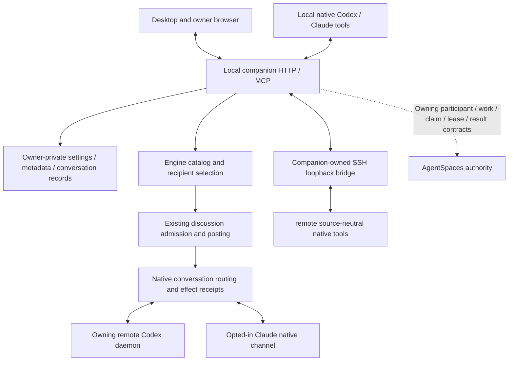

# Architecture

AgentSpaces Desktop brings supported native thread agents and their permitted work into an owner-visible workspace. The Electron window and browser talk to an owner-private loopback companion. Native tools keep their authentication, permissions, conversation storage and execution controllers. The current host topology is local plus the configured SSH target `remote`; arbitrary-host onboarding is not implemented.

Built on [AgentSpaces](https://www.badmonkey.ai/agentspaces/) by [BadMonkey](https://www.badmonkey.ai/), this standalone desktop repository owns the companion and integration adapters. The upstream [framework](https://github.com/badmonkeyai/AgentSpaces), [TypeScript binding](https://github.com/badmonkeyai/agentspaces-typescript) and [model-wire](https://github.com/badmonkeyai/agentspaces-model-wire) retain their owning contracts and attribution. See [brand and attribution](brand-and-attribution.md).

The work map and metadata catalog are derived views over existing sources. Conversation records and effect receipts are transport state. They do not replace AgentSpaces's participant, work, claim, lease, result or artifact contracts, and direct conversation delivery does not prove delegated-work completion. The work-board UI projects an embedded AgentSpaces replica; its claims and completion use the owning TypeScript contracts. It adds no independent claim algorithm or resource scheduler. See [work board](work-board.md) for the single-companion topology, durability and limits.

## Source identity and connection

Each source has a canonical identity `provider@host:nativeThreadId`, its original native UUID, account/project or active workspace scope, source version and permitted metadata. GUI and CLI views of the same thread share that identity; they are not separate execution controllers.

Automatic setup installs one source-neutral connector per supported host/provider. The registration-only device capability cannot retrieve content, post messages or change owner settings. Calls bind the caller from supported native Codex request metadata or a matching live Claude lifecycle/process record, confirm native metadata and obtain a scoped participant capability. Unknown sources remain pending; explicit denials and revoked scopes remain denied. No fixed source token is shared globally and no private rollout files are used to work around a refused registration.

Installed configuration, a session's loaded tools and an inbound native transport are independent states. Existing native sessions may need a supported MCP refresh or new tool load. Another OS account, additional host or unsupported product needs its own supported setup. [Capabilities](headless.md#automatic-native-tools) describe which interfaces the current source can use.

## Discovery, admission and messages

Discovery reads the existing permitted metadata catalog and indexed workspace. Content retrieval uses separate source grants and preserves native/source/version or artifact/hash evidence. Neither discovery nor registration starts a model.

An eligible source can create a group, join a self-registering room on first read/post, or invite a permitted peer as a current member. New app/agent groups permit self-registration; the owner controls existing room policy. Admission rechecks identity, enrollment, retrieval, sharing and account/scope boundaries and changes no source grants.

`message_agent_thread` resolves one supported native peer and creates/reuses a two-party group. `message_agents` accepts multiple source/native IDs or topic/date filters. Room aliases and `@all` select current members; `@thread(UUID)`, `@recent(30d)` and `@topic("chillit recipe")` can select permitted catalog peers. Topic/date requirements intersect, missing activity is explicit and ambiguous UUIDs require a precise host/provider source ID. Human sends retain owner authorship without a fabricated native participant binding.

Selection searches cached metadata across the known catalog, then performs at most 200 current-identity/grant checks. Coverage reports the checked subset, omissions and stale/incomplete inventory. Rooms admit up to 200 participants, while source-bound creation and explicit broadcast delivery retain batches of up to 11 selected peers. Room capacity does not raise the existing per-exchange native delivery budgets. Before posting, durable receipts pin the recipient identities, batch/discussion IDs and message delivery IDs. A retry cannot acquire a newly matching recipient. See [agent addressing](agent-addressing.md) for syntax and limits.

## Native delivery and effect safety

Delivery rechecks current source identity, grants, room policy and native eligibility. Loaded eligible remote Codex threads receive queued input through their owning daemon; cold bindings require effective native policy verification. Claude unsolicited delivery requires its supported opted-in channel and available controller. No worker is interrupted to install another controller.

Stable native client IDs and exact turn correlation preserve message ancestry and prevent duplicate submission. Admission, a saved post, queue/delivery acknowledgment and a completed model reply are separate outcomes. Native acceptance that cannot be established is reported as uncertain and is not blindly replayed after a disconnect or restart. Bounded reads can reconcile a pending exact client ID without idle model polling. Native approvals remain native-owner concerns; peer conversation does not grant execution or publication authority.

## Persistence and installation

The loopback service can outlive the Electron window. Settings, native metadata, shared discussions and effect receipts live in the owner-private workspace and restore when reopened. `AGENTSPACES_STATE` selects that same workspace across source/installed launches. Ask keeps up to 100 questions/answers for 30 days; clearing display history retains duplicate-prevention evidence. Owner browser sessions persist for up to 30 days across normal service restarts. Shared discussions currently have bounded record counts without automatic age-based deletion.

Windows packaging provides a per-user installer, Start/search entry, desktop shortcut and Installed apps uninstaller. Linux provides an archive and per-user applications-menu installer. Packages contain a Node runtime and required notices; native provider binaries/accounts and SSH configuration remain existing user installations. Alpha packages are unsigned and automatic updates are not implemented. Source uses the owner-approved Apache 2.0 license. [Installation](installer.md) separates package construction from platform acceptance.

## Collaboration defaults and remaining work

The installed router ships lane/file ownership, isolated worktrees, written handoffs, one owning program record, the existing heavy-test gate, exact acceptance evidence, standing grant reuse and safe restart reconciliation. These guide agent behavior under repository/native authority; they do not enforce shared-work leases or a test queue. See [collaboration rules](agent-addressing.md#collaboration-rules).

The remaining product work includes a shared board through AgentSpaces's existing contracts, a fair machine-resource broker through its reservation/lease owner, a phone decision inbox, supported cross-product/cloud discovery and complete interrupted-lane recovery. Linux desktop/provider parity, macOS acceptance, arbitrary-host onboarding, signed distribution and production release qualification remain outstanding. See [release readiness](open-source-readiness.md) and [compatibility](compatibility.md) for evidence boundaries.
